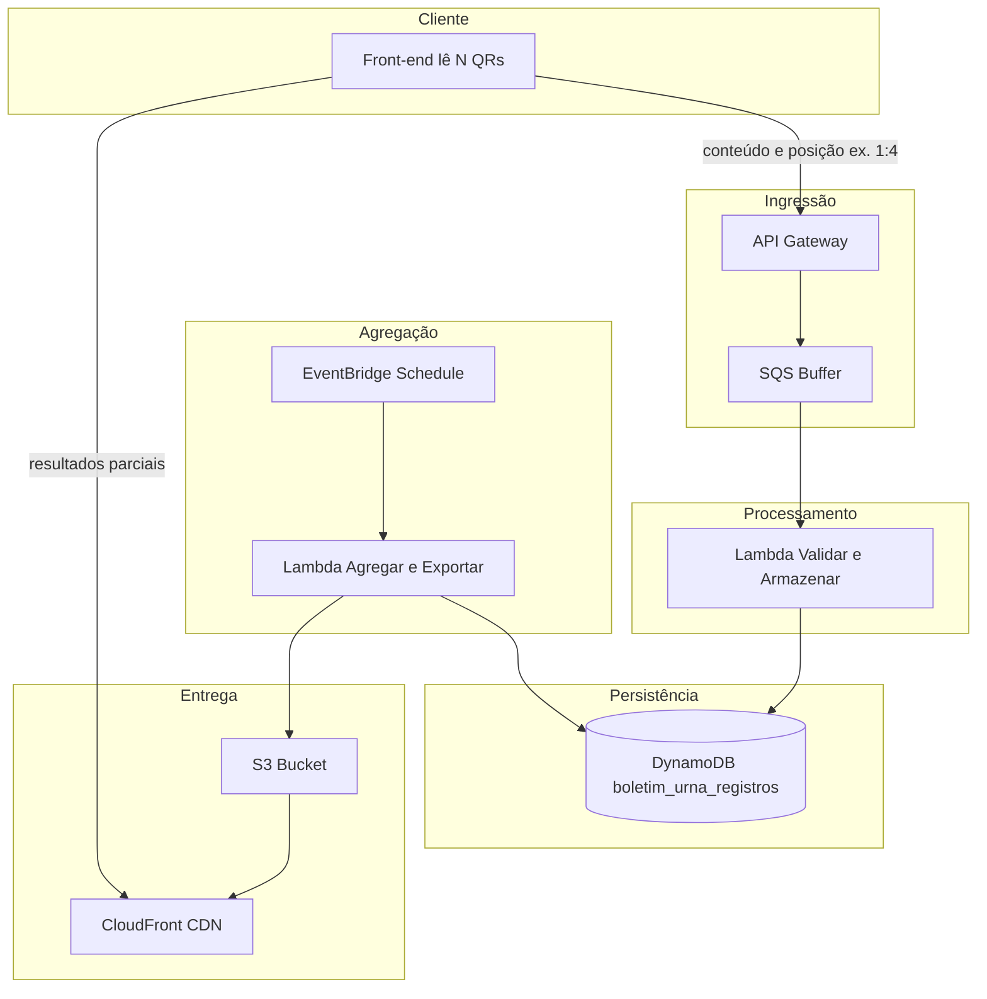

# Arquitetura

## Diagrama de fluxo

## Componentes

| Componente | Função |
|------------|--------|
| **API Gateway** | Recebe POST com conteúdo do QR e posição; integra com Lambda de ingestão. |
| **SQS (buffer)** | Fila de mensagens; uma mensagem por QR; trigger direto da Lambda Validar e Armazenar. |
| **Lambda Ingest** | Valida o body do request e publica uma mensagem SQS por QR. |
| **Lambda Validar e Armazenar** | Valida formato e assinatura TSE; grava item em DynamoDB. |
| **DynamoDB** | Tabela `boletim_urna_registros` com `boletim_id`, posição e conteúdo/metadados do QR. |
| **EventBridge Schedule** | Dispara a Lambda de agregação em intervalo fixo (ex.: a cada 5 minutos). |
| **Lambda Agregar e Exportar** | Lê a tabela, agrupa por boletim e município, soma votos, gera JSON por cidade e envia ao S3. |
| **S3** | Armazena `resultados/{codigo_municipio}.json`. |
| **CloudFront** | CDN para servir os JSON ao front-end. |

## Decisões técnicas

- **Sem Step Function:** a SQS invoca diretamente a Lambda Validar e Armazenar.
- **Agregação por schedule:** evita disparar agregação a cada mensagem e reduz concorrência na escrita no S3.
- **Um JSON por cidade por execução:** escrita atômica para evitar sobrescrita inconsistente.
